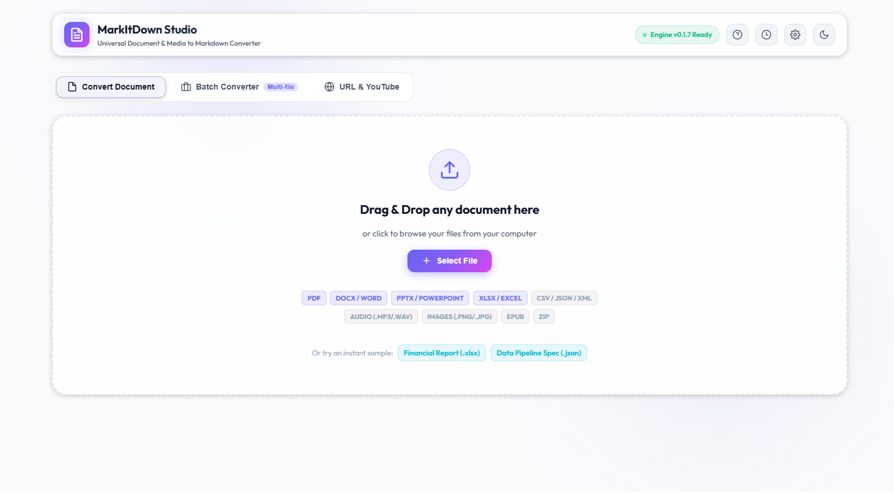
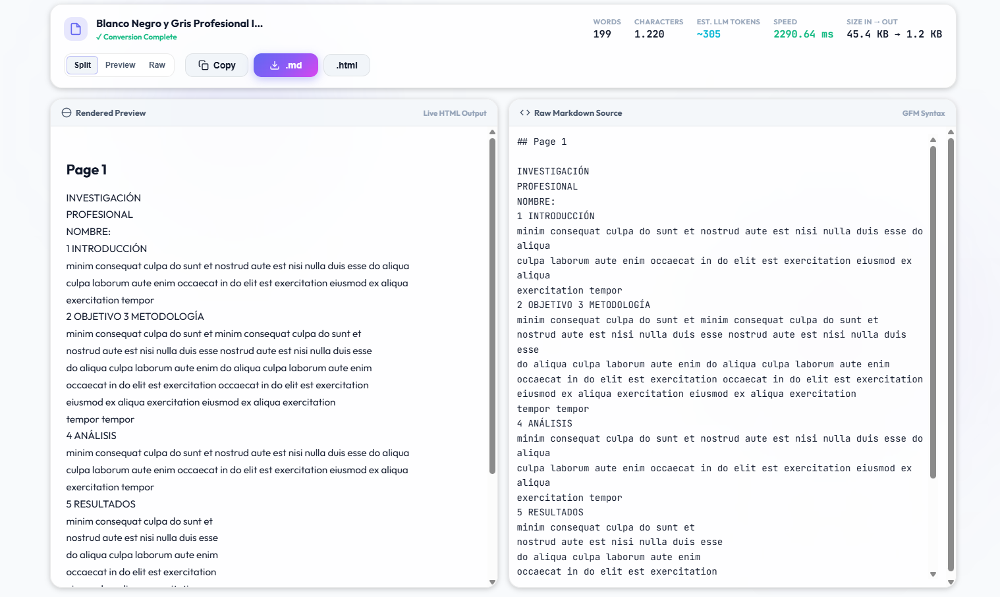
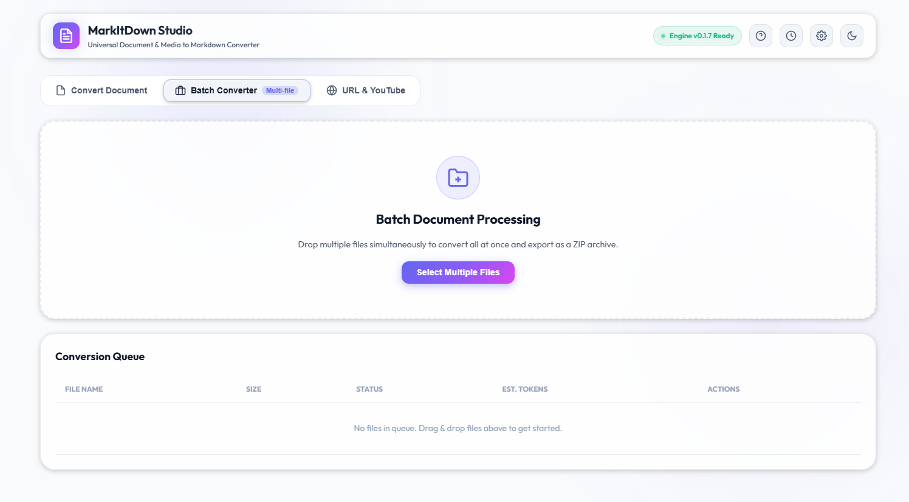

# 🚀 MarkItDown Studio

<div align="center">


**Interfaz Gráfica Moderna y API REST para el motor universal de conversión [Microsoft MarkItDown](https://github.com/microsoft/markitdown).**

Convierte documentos, hojas de cálculo, presentaciones, imágenes con OCR y videos de YouTube a **Markdown limpio** en segundos con previsualización en tiempo real.

<br/>



<br/>

[Características](#-características) • [Capturas](#-capturas-de-pantalla) • [Instalación Rápida](#-inicio-rápido) • [Docker](#-ejecución-con-docker) • [Configuración de IA](#-configuración-de-ia-y-visión-ocr) • [API REST](#-documentación-de-la-api-rest)

</div>

---

## 🌟 Características

- 🎯 **Arrastrar y Soltar Universal (Drag & Drop)**:
  - **Documentos**: PDF, Word (`.docx`, `.doc`), PowerPoint (`.pptx`, `.ppt`), EPub, Outlook (`.msg`).
  - **Datos y Hojas de Cálculo**: Excel (`.xlsx`, `.xls`), CSV, JSON, XML, YAML.
  - **Web y Código**: HTML, Markdown, Texto plano, Jupyter Notebooks (`.ipynb`).
  - **Audio y Voz**: Transcripción de audio (`.mp3`, `.wav`, `.m4a`, `.ogg`, `.flac`).
  - **Archivos Comprimidos**: ZIP (convierte el contenido interior automáticamente).
- 👁️ **Visor Dual de Markdown (Split View Workspace)**:
  - **Modo Renderizado**: Previsualización HTML enriquecida con tablas formateadas, listas, citas y resaltado de bloques de código (*highlight.js*).
  - **Modo Código (Raw Markdown)**: Editor monospaciado para copiar o inspeccionar el Markdown fuente.
  - Alternador de vista: *Pantalla Dividida (Side-by-Side)*, *Solo Previsualización*, *Solo Código*.
- 🖼️ **Extracción y Visión OCR con IA (OpenRouter / OpenAI / Ollama)**:
  - Transcribe texto, tablas y datos manuscritos dentro de imágenes directamente a Markdown.
  - Compatible con modelos de visión como `openai/gpt-4o-mini`, `qwen/qwen-2-vl-72b-instruct`, `google/gemini-2.0-flash-001` y modelos locales en Ollama (`llava`, `llama3.2-vision`).
- 📦 **Procesamiento Masivo por Lotes (Batch Mode)**:
  - Carga múltiples archivos simultáneamente con barra de progreso interactiva.
  - Botón para descargar todas las conversiones en un único archivo **`.zip`**.
- 🌐 **Conversor de URLs y YouTube**:
  - Extrae artículos de páginas web, Wikipedia y transcripciones completas de videos de YouTube.
- 📊 **Métricas y Análisis en Tiempo Real**:
  - Conteo de palabras, caracteres, líneas y **estimación de tokens LLM** (para OpenAI GPT-4, Claude, Llama).
  - Velocidad de procesamiento en milisegundos y tasa de tamaño in/out.
- 📋 **Acciones Rápidas con 1 Clic**:
  - Copiar Markdown al portapapeles con animación de confirmación.
  - Descarga directa de archivos `.md` y exportación a página `.html`.
- 🎨 **Diseño Glassmorphism Premium**:
  - Tema Oscuro y Tema Claro con persistencia automática en el navegador.

---

## 📸 Capturas de Pantalla

### 🖥️ 1. Interfaz Principal y Zona Drag & Drop
Carga cualquier documento arrastrando o seleccionando el archivo con detección automática de tipo MIME:
<p align="center">
  
</p>

### 👁️ 2. Espacio de Trabajo con Vista Dividida (Split View)
Visualiza el HTML formateado a la izquierda y el código Markdown fuente a la derecha con métricas de tokens en vivo:
<p align="center">
  
</p>

### 📦 3. Convertidor Masivo por Lotes (Batch Mode)
Convierte múltiples documentos a la vez con barra de progreso y descarga todo en un único archivo comprimido `.zip`:
<p align="center">
  
</p>

---

## 🚀 Inicio Rápido

### 1. Clonar el repositorio
```bash
git clone https://github.com/euclides-ollarves/markitdown_studio.git
cd markitdown_studio
```

### 2. Crear y activar el entorno virtual
```bash
# En Windows (PowerShell)
python -m venv .venv
.\.venv\Scripts\activate

# En Linux / macOS
python3 -m venv .venv
source .venv/bin/activate
```

### 3. Instalar dependencias
```bash
pip install -r requirements.txt
```

### 4. Configurar variables de entorno (Opcional)
Copia la plantilla `.env.example` a `.env` y coloca tu API Key de OpenRouter / OpenAI para habilitar la visión por IA:
```bash
cp .env.example .env
```

### 5. Iniciar la aplicación
```bash
python run_gui.py
```
*El navegador se abrirá automáticamente en `http://127.0.0.1:8000`.*

---

## 🐳 Ejecución con Docker

Si prefieres ejecutar MarkItDown Studio en un contenedor Docker:

```bash
docker compose up --build
```
Accede a la interfaz web en: `http://localhost:8000`.

---

## ⚙️ Configuración de IA y Visión OCR

MarkItDown Studio permite extraer texto de imágenes mediante proveedores compatibles con OpenAI:

| Proveedor | Base URL | Modelos Recomendados |
| :--- | :--- | :--- |
| **OpenRouter** | `https://openrouter.ai/api/v1` | `openai/gpt-4o-mini`, `qwen/qwen-2-vl-72b-instruct` |
| **OpenAI** | `https://api.openai.com/v1` | `gpt-4o-mini`, `gpt-4o` |
| **Ollama (Local)** | `http://localhost:11434/v1` | `llava`, `llama3.2-vision` |

Puedes configurar tu clave en el archivo `.env` o directamente en el modal de **Configuración ⚙️** de la interfaz web.

---

## 🔌 Servidor MCP (Model Context Protocol)

MarkItDown Studio incluye un **servidor MCP nativo** (`mcp_server.py`) que permite a asistentes como **Claude Desktop**, **Cursor**, **Gemini IDE / Antigravity**, **Cline** y **Roo Code** convertir archivos locales y páginas web a Markdown directamente en sus chats.

### 🛠️ Herramientas MCP Disponibles (Tools):
- `convert_document(file_path)`: Convierte cualquier archivo local (PDF, Word, Excel, PPTX, MP3, ZIP, etc.) a Markdown.
- `convert_image_ocr(image_path, custom_prompt)`: Transcribe texto y tablas de imágenes con modelos de visión.
- `convert_url(url)`: Convierte páginas web y transcripciones de YouTube a Markdown.
- `analyze_document_metrics(file_path)`: Retorna métricas detalladas (palabras, líneas, caracteres y estimación de tokens LLM).
- `get_supported_formats()`: Lista de todas las extensiones soportadas.

### ⚙️ Configuración en Clientes MCP:

#### 1. Claude Desktop (`claude_desktop_config.json`):
```json
{
  "mcpServers": {
    "markitdown": {
      "command": "python",
      "args": [
        "C:\\ruta\\a\\markitdown_studio\\mcp_server.py"
      ],
      "env": {
        "OPENROUTER_API_KEY": "tu_clave_aqui"
      }
    }
  }
}
```

#### 2. Antigravity IDE (`~/.gemini/config/mcp_config.json`):
```json
{
  "mcpServers": {
    "markitdown": {
      "command": "C:\\Users\\info-analista8\\Documents\\python_dev\\markitdown\\.venv\\Scripts\\python.exe",
      "args": [
        "C:\\Users\\info-analista8\\Documents\\python_dev\\markitdown\\mcp_server.py"
      ],
      "env": {
        "OPENROUTER_API_KEY": "tu_clave_aqui"
      }
    }
  }
}
```

#### 3. Cursor IDE (`.cursor/mcp.json`):
```json
{
  "mcpServers": {
    "markitdown": {
      "command": "python",
      "args": ["mcp_server.py"]
    }
  }
}
```

---

## 📡 Documentación de la API REST

MarkItDown Studio incluye una API REST completa construida con FastAPI:

| Método | Endpoint | Descripción |
| :--- | :--- | :--- |
| `POST` | `/api/convert` | Convierte un archivo individual a Markdown (Multipart Form). |
| `POST` | `/api/convert-url` | Convierte una página web o video de YouTube a Markdown (JSON). |
| `POST` | `/api/batch-convert` | Convierte múltiples archivos en un lote (Multipart Form). |
| `GET` | `/api/supported-formats` | Lista todos los formatos y categorías soportadas. |
| `GET` | `/api/health` | Estado de salud y versión del servicio. |
| `GET` | `/docs` | Documentación interactiva Swagger / OpenAPI. |

---

## 🧪 Pruebas Automatizadas

Ejecuta el conjunto de pruebas para validar los conversores y el servidor MCP:

```bash
python tests/test_gui_conversion.py
python tests/test_xlsx_conversion.py
python tests/test_docx_pptx.py
python tests/test_image_conversion.py
python tests/test_mcp_server.py
```

---

## 📁 Estructura del Proyecto

```text
markitdown_studio/
├── gui/
│   ├── __init__.py
│   ├── app.py                     # API FastAPI y servidor de archivos estáticos
│   ├── markitdown_service.py      # Wrapper de MarkItDown y motor OCR
│   └── static/
│       ├── index.html             # Interfaz web interactiva
│       ├── css/
│       │   └── style.css          # Estilos Glassmorphic Dark/Light
│       └── js/
│           └── app.js             # Lógica reactiva del cliente
├── tests/                         # Suite de pruebas automatizadas
├── .env.example                   # Plantilla de variables de entorno
├── .gitignore                     # Archivos ignorados por Git
├── Dockerfile                     # Configuración de imagen Docker
├── docker-compose.yml             # Orquestación Docker Compose
├── requirements.txt               # Dependencias del proyecto
├── run_gui.py                     # Lanzador con detección automática de entorno
└── README.md                      # Documentación principal
```

---

## 📄 Licencia

Este proyecto está bajo la Licencia [MIT](LICENSE). Basado en la librería [Microsoft MarkItDown](https://github.com/microsoft/markitdown).
